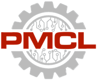
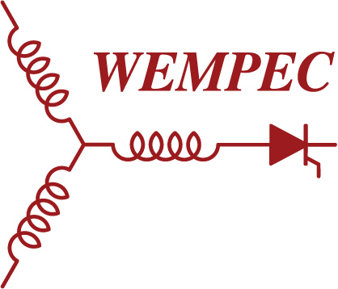
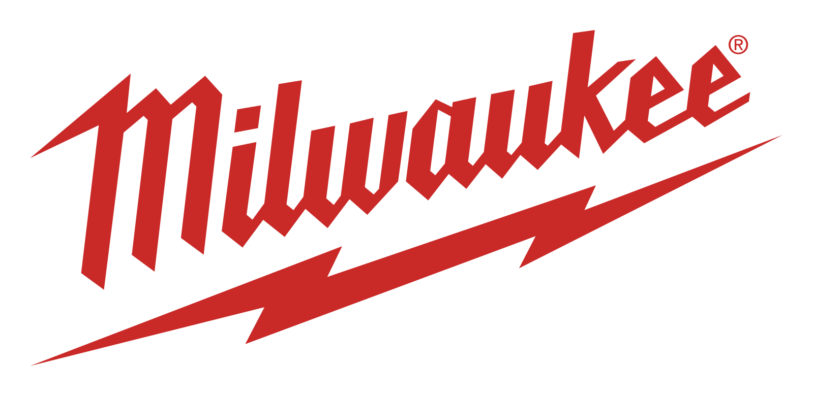
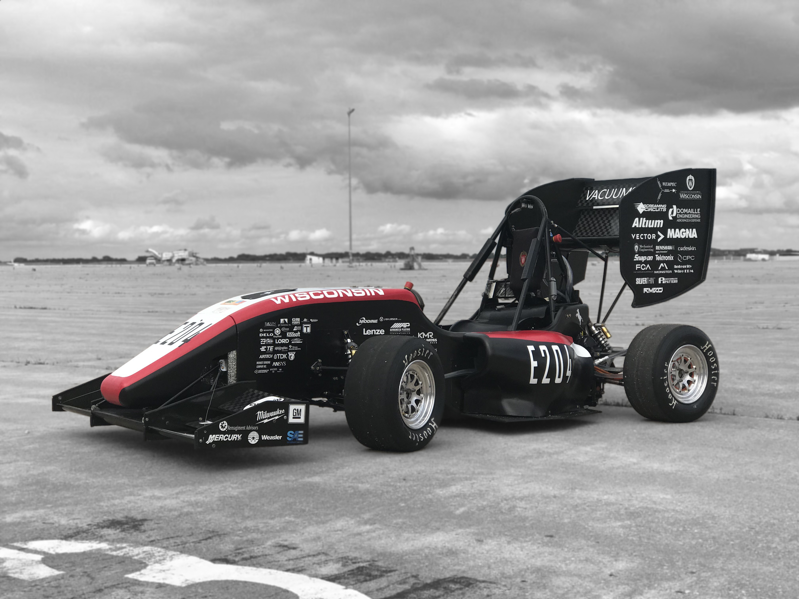
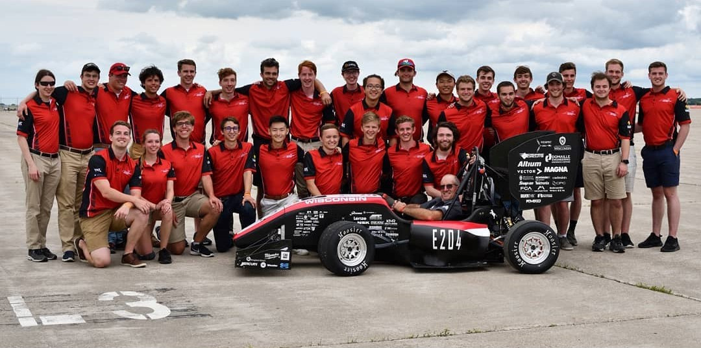

# Education 
## University of Wisconsin - Madison  <i class="fa fa-solid fa-graduation-cap"></i>  

* <b>Ph.D. in Electrical and Computer Engineering</b>, *TBD*
* <b>M.S. in Electrical and Computer Engineering</b>, *Summer 2024*
* <b>B.S. in Mechanical Engineering</b>, *Fall 2021*

#### Relavent Coursework
* Linear Systems
* Electromagnetic Design of AC Machines
* Dynamics and Control of AC Drives
* Redesign and Prototype Fabrication
* Power Electronic Circuits and Laboratory
* Automatic Controls Laboratory
* Finite Elements 

 

# Experience

## Motibera, Inc. [motibera.com](https://motibera.com) 
<b>Motor Design Engineer Intern</b>, <em>May 2025 - Present</em>
 

## Precision Mechatronics and Control Lab - [pmcl.me.wisc.edu](https://pmcl.me.wisc.edu/) 
<b>Research Assistant</b>, <em>August 2024 - Present</em>

Advisor: Lei Zhou
 

## Severson Research Group - [severson.wempec.wisc.edu](https://severson.wempec.wisc.edu/) 
<b>Research Assistant</b>, <em>September 2022 - June 2024</em>

### Projects
  * Additively Manufactured Stator Housing for High-Speed Bearingless Generator
  * Bearingless Machines (BSPM) for Aerial E-Turbocharger Application 

 

## Milwaukee Tool - [milwaukeetool.com](https://www.milwaukeetool.com/) 
<b>NPD Mechanical Design Engineer</b>, <em>January - August 2022</em>
* Conducted FEA analysis on BLDC motors of different sizes and winding configurations, recommended optimal designs for product development using Pugh Matrix for informed and cost-effective solutions.
* Assessed power tool performance requirements through the collection and analysis of motor thermal characteristics and power output data from competitor products.
 

## Wisconsin Electric Machines and Power Electronics Consortium  - [wempec.wisc.edu](wempec.wisc.edu) 
<b>Undergraduate Researcher & Lab Assistant</b>, <em>September 2019 – December 2021</em>

I joined WEMPEC as a research lab assistant working directly under lab manager Kyle Hansen.
I was accountable for prototyping a new 10 N-m dynamometer setup and various lab tasks such as electric machines fabrication for the WEMPEC research lab. In 2020, I moved on to a new role as an undergraduate reseacher working directly under Prof. Eric Severson, where I investigated and performed literature review on the current development of passive permanent and superconducting magnetic bearing technologies.
 

# Extracurricular
## Wisconsin Racing Electric - [wisconsinracing.org](https://www.wisconsinracing.org/) 
<b>Chassis Team Member</b>, <em>2018 - 2021</em>

Competed in FSAE Electric 2019 in Lincoln, NE, received 2nd place in design category. I worked on various projects such as prototyping the enclosure for the TSAL warning light system using SLA 3D printing. Accumulated over 75+ hours of machining experience in manufacturing chassis steering and welding jig components.

<!--   -->

 

## UW CoE Undergraduate Learning Center 
<b>Undergraduate Tutor</b>, <em>January - December 2019</em>

I work as a student tutor under the Undergraduate Learning Center in College of Engineering. Provided group and one-on-one tutoring for 30+ undergraduate students each week.
 
 
 

# Publications
  <ul>
    
  </ul>

 
 
  
# Skills
## Hands-on
* Electric Machine Fabrication 
* Component Machining and Assembly
* CAD Design and Drafting (GD&T)
  
## Software
* Python
* SolidWorks
* Siemens NX
* ANSYS
* Altium
* LabView
* MATLAB/Simulink
* Siemens MAGNET
* FEMM
* JMAG
* LaTeX

## Language 
* English 
* Mandarin Chinese
* Cantonese

  

